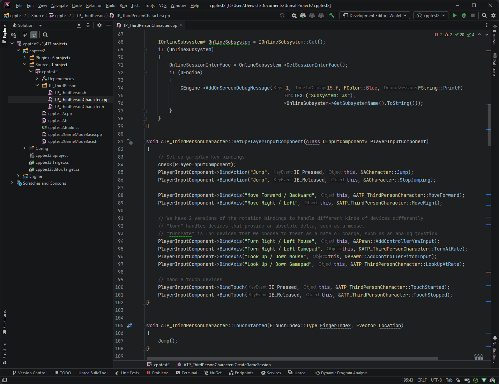

Unreal Simple theme for JetBrains IDE (Rider, CLion, WebStorm, PyCharm, etc..).

Default theme:

Vivid theme:

How to install:

- Go to `Settings (Preferences)` > `Plugins`, find the theme plugin and install it.
- Restart IDE.
- Go to `Settings (Preferences)` > `Appearance & Behavior` > `Appearance` and see the Theme dropdown.

You can find this theme on JetBrains Marketplace:
https://plugins.jetbrains.com/plugin/19082-dysh-unreal-simple-theme/

Recommended font: JetBrains Mono or Consolas.
